# ZANDD HSM Management Interface - Project Plan

## 🎯 **Project Overview**

Building on the successful ZANDD HSM & Certificate Authority implementation, this project creates a comprehensive **Management Interface** for the HSM system with **vault management**, **key operations**, and **online CA services**.

### **Project Objectives**
1. **HSM Management Interface** - Desktop application for vault and key management
2. **Vault System** - TPM-backed secure key storage with encryption
3. **Key Lifecycle Management** - CRUD operations for wrapped keys
4. **CSR Integration** - Generate certificate signing requests from stored keys
5. **Online CA Service** - Web-based certificate authority with verification

---

## 🏗️ **System Architecture**

### **Component Overview**


---

## 📋 **Phase 1: HSM Management Interface**

### **1.1 Application Framework** *(Week 1-2)*
**Technology Stack**: WPF (.NET 6) or Electron with Node.js backend

#### **Core Components**
- **Main Window**: Vault selection and overview dashboard
- **Vault Manager**: Create, open, and manage HSM vaults
- **Key Browser**: TreeView of stored keys with metadata
- **Key Editor**: Create, view, edit, and delete key operations
- **Settings Panel**: HSM configuration and preferences

#### **User Interface Design**
```
┌─────────────────────────────────────────────────────────┐
│ ZANDD HSM Manager                        [_] [□] [✕]   │
├─────────────────────────────────────────────────────────┤
│ File  Vault  Keys  Tools  Help                        │
├─────────────────────────────────────────────────────────┤
│                                                         │
│ ┌─ Vaults ──────────┐ ┌─ Key Management ─────────────┐ │
│ │ □ Production-HSM   │ │ 📁 Client Keys (15)          │ │
│ │ □ Development-HSM  │ │ │ ├─ 🔑 john.doe@company.com │ │
│ │ □ Test-HSM         │ │ │ ├─ 🔑 server.example.com   │ │
│ │                    │ │ │ └─ 🔑 code-signing-2025   │ │
│ │ [Create New Vault] │ │ 📁 Server Keys (8)          │ │
│ └────────────────────┘ │ 📁 Code Signing (3)         │ │
│                        │                              │ │
│ ┌─ Operations ─────────┐ │ [Create Key] [Import] [CSR] │ │
│ │ TPM Status: ✓ Ready  │ └──────────────────────────────┘ │
│ │ Vault: Unlocked     │                                │ │
│ │ Keys: 26 active     │ ┌─ Key Details ──────────────────┐ │
│ │ Performance: 145/s  │ │ Name: john.doe@company.com     │ │
│ │                     │ │ Type: ECDSA P-256             │ │
│ │ [Generate Report]   │ │ Created: 2025-08-10 16:45     │ │
│ └─────────────────────┘ │ Usage: Client Authentication  │ │
│                        │ Status: Active                 │ │
│                        │                                │ │
│                        │ [View Cert] [Generate CSR]    │ │
│                        │ [Export] [Revoke] [Delete]    │ │
│                        └────────────────────────────────┘ │
└─────────────────────────────────────────────────────────┘
```

### **1.2 Vault Management System** *(Week 2-3)*

#### **Vault Creation Workflow**


#### **Vault Structure**
```json
{
  "vaultMetadata": {
    "name": "Production-HSM",
    "created": "2025-08-10T16:45:00Z",
    "version": "1.0",
    "tpmBacked": true,
    "keyCount": 26,
    "lastAccessed": "2025-08-10T18:30:00Z"
  },
  "encryptionInfo": {
    "algorithm": "AES-256-GCM",
    "keyDerivation": "PBKDF2-SHA256",
    "tpmEntropy": "hardware-derived",
    "salt": "base64-encoded-salt"
  },
  "keyStore": {
    "encrypted": "base64-encoded-encrypted-key-data"
  }
}
```

### **1.3 Key CRUD Operations** *(Week 3-4)*

#### **Key Management Features**
- **Create**: Generate new hybrid TPM+Software keys
- **Read**: View key metadata, certificates, usage history
- **Update**: Modify key metadata, change passwords, update certificates
- **Delete**: Securely remove keys with confirmation

#### **Key Types Supported**
- 🔐 **Client Authentication Keys**
- 🌐 **Server/TLS Keys**
- 📝 **Code Signing Keys**
- 📧 **Email/S-MIME Keys**
- 🎯 **Multi-Purpose Keys**

#### **Key Operations Interface**
```
┌─ Create New Key ────────────────────────────────────────┐
│                                                         │
│ Key Name: [john.doe@company.com                    ]   │
│                                                         │
│ Key Type: [Client Authentication        ▼]             │
│                                                         │
│ Algorithm: ○ ECDSA P-256  ○ ECDSA P-384  ○ RSA 2048    │
│                                                         │
│ ┌─ Subject Information ─────────────────────────────────┐ │
│ │ Common Name: [John Doe                           ]  │ │
│ │ Organization: [ZANDD                             ]  │ │
│ │ Email: [john.doe@company.com                     ]  │ │
│ │ Country: [US] State: [State] City: [City        ]  │ │
│ └─────────────────────────────────────────────────────┘ │
│                                                         │
│ □ Generate Certificate Immediately                      │
│ □ Add to Windows Certificate Store                      │
│                                                         │
│ [Cancel]                              [Create Key]     │
└─────────────────────────────────────────────────────────┘
```

---

## 📋 **Phase 2: CSR Integration & CA Services** 

### **2.1 CSR Generation System** *(Week 4-5)*

#### **CSR Workflow**

```mermaid
sequenceDiagram
    participant User
    participant HSM_UI
    participant Key_Store
    participant CSR_Engine
    participant ZANDD_CA

    User->>HSM_UI: Select Key → Generate CSR
    HSM_UI->>Key_Store: Load Private Key
    Key_Store->>CSR_Engine: Provide Key + Subject Info
    CSR_Engine->>CSR_Engine: Create CSR with Extensions
    CSR_Engine->>HSM_UI: Return Signed CSR
    HSM_UI->>User: Display CSR (PEM format)
    User->>HSM_UI: Submit to ZANDD CA
    HSM_UI->>ZANDD_CA: Send CSR for Signing
    ZANDD_CA->>HSM_UI: Return Signed Certificate
    HSM_UI->>Key_Store: Store Certificate with Key
```


#### **CSR Generation Features**
- **Template-based CSR creation** with predefined extensions
- **Custom extension support** for specialized certificates
- **Multiple format export** (PEM, DER, Base64)
- **Batch CSR generation** for multiple keys
- **Integration with ZANDD CA** for automatic signing

### **2.2 ZANDD CA Integration** *(Week 5-6)*

#### **CA Service Integration**
- **Direct API calls** to ZANDD CA service
- **Certificate validation** and chain verification
- **Automatic certificate installation** to key store
- **Certificate lifecycle management** (renewal, revocation)

---

## 📋 **Phase 3: Online CA Web Service**

### **3.1 Web API Development** *(Week 6-8)*

#### **Technology Stack**
- **Backend**: ASP.NET Core 6 Web API
- **Frontend**: React.js with TypeScript
- **Database**: PostgreSQL or SQL Server
- **Authentication**: OAuth 2.0 + JWT tokens
- **Deployment**: Docker containers

#### **API Endpoints**
```http
# Certificate Management
POST   /api/v1/certificates/request     # Submit CSR
GET    /api/v1/certificates/{id}        # Get certificate
GET    /api/v1/certificates/            # List certificates
DELETE /api/v1/certificates/{id}        # Revoke certificate

# Certificate Validation
POST   /api/v1/validate/certificate     # Validate certificate
GET    /api/v1/validate/chain/{id}      # Validate certificate chain
GET    /api/v1/ca/certificate           # Get CA certificate
GET    /api/v1/ca/crl                   # Get Certificate Revocation List

# OCSP Services
POST   /api/v1/ocsp                     # OCSP request
GET    /api/v1/ocsp/{serial}            # OCSP status check
```

### **3.2 Web Management Portal** *(Week 8-9)*

#### **Portal Features**
```
┌─ ZANDD CA Web Portal ──────────────────────────────────┐
│ Home  Certificates  Validation  CA Info  Admin        │
├─────────────────────────────────────────────────────────┤
│                                                         │
│ ┌─ Certificate Request ─────────────────────────────────┐ │
│ │                                                       │ │
│ │ Upload CSR: [Choose File] certificate.csr            │ │
│ │                                                       │ │
│ │ Certificate Type: [Client Authentication  ▼]         │ │
│ │                                                       │ │
│ │ Validity Period: [1 Year ▼]                          │ │
│ │                                                       │ │
│ │ □ Email certificate when ready                        │ │
│ │                                                       │ │
│ │ [Submit Request]                                      │ │
│ └───────────────────────────────────────────────────────┘ │
│                                                         │
│ ┌─ Certificate Validation ──────────────────────────────┐ │
│ │                                                       │ │
│ │ Upload Certificate: [Choose File] cert.pem           │ │
│ │                                                       │ │
│ │ [Validate Certificate] [Check Revocation]            │ │
│ │                                                       │ │
│ │ Validation Result: ✓ Certificate is Valid            │ │
│ │ Issued by: ZANDD Root CA                              │ │
│ │ Valid until: 2026-08-10                               │ │
│ └───────────────────────────────────────────────────────┘ │
└─────────────────────────────────────────────────────────┘
```

### **3.3 Online Verification Service** *(Week 9-10)*

#### **Verification Features**
- **Real-time certificate validation** against ZANDD CA
- **Certificate chain verification** with trust path validation
- **Revocation checking** via CRL and OCSP
- **Batch certificate verification** for enterprise clients
- **API-based verification** for application integration

#### **Cryptographic Verification Process**


---

## 📋 **Phase 4: Advanced Features**

### **4.1 Enhanced Security Features** *(Week 10-11)*
- **Hardware attestation** verification
- **Secure audit logging** of all operations
- **Role-based access control** (RBAC)
- **Multi-factor authentication** for sensitive operations
- **Backup and disaster recovery** procedures

### **4.2 Enterprise Integration** *(Week 11-12)*
- **Active Directory integration** for user management
- **LDAP support** for enterprise directories
- **Certificate template** system for standardized issuance
- **Bulk certificate operations** for large deployments
- **Compliance reporting** for audit requirements

### **4.3 Monitoring & Analytics** *(Week 12)*
- **Performance monitoring** dashboard
- **Usage analytics** and reporting
- **Health checks** and alerting
- **Certificate expiration monitoring**
- **Automated renewal** notifications

---

## 🚀 **Implementation Timeline**

### **12-Week Development Schedule**

| Week | Phase | Deliverable | Status |
|------|-------|-------------|---------|
| 1-2  | Phase 1.1 | HSM Management Interface Framework | 📋 Planned |
| 2-3  | Phase 1.2 | Vault Management System | 📋 Planned |
| 3-4  | Phase 1.3 | Key CRUD Operations | 📋 Planned |
| 4-5  | Phase 2.1 | CSR Generation System | 📋 Planned |
| 5-6  | Phase 2.2 | ZANDD CA Integration | 📋 Planned |
| 6-8  | Phase 3.1 | Online CA Web API | 📋 Planned |
| 8-9  | Phase 3.2 | Web Management Portal | 📋 Planned |
| 9-10 | Phase 3.3 | Online Verification Service | 📋 Planned |
| 10-11| Phase 4.1 | Enhanced Security Features | 📋 Planned |
| 11-12| Phase 4.2 | Enterprise Integration | 📋 Planned |
| 12   | Phase 4.3 | Monitoring & Analytics | 📋 Planned |

---

## 🏗️ **Technical Specifications**

### **HSM Management Interface**
- **Platform**: Windows 10/11 (64-bit)
- **Framework**: .NET 6 WPF or Electron + Node.js
- **Database**: SQLite for local storage, PostgreSQL for enterprise
- **Security**: AES-256-GCM encryption, PBKDF2 key derivation
- **Performance**: Support for 10,000+ keys per vault

### **Online CA Service**
- **Backend**: ASP.NET Core 6 Web API
- **Frontend**: React 18 with TypeScript
- **Database**: PostgreSQL with Entity Framework Core
- **Hosting**: Docker containers on Linux
- **Security**: OAuth 2.0, JWT tokens, HTTPS only
- **Scalability**: Horizontally scalable with load balancing

### **Integration Requirements**
- **TPM Support**: Windows TPM 2.0 with Platform Crypto Provider
- **Certificate Formats**: X.509 v3, PEM, DER, PKCS#12
- **Standards Compliance**: RFC 5280 (X.509), RFC 2986 (PKCS#10)
- **Crypto Algorithms**: ECDSA P-256/P-384, RSA 2048/4096, SHA-256/SHA-384

---

## 📊 **Success Metrics**

### **Performance Targets**
- **Key Operations**: < 100ms per CRUD operation
- **Vault Loading**: < 2 seconds for 1,000 keys
- **CSR Generation**: < 500ms per certificate
- **Web API Response**: < 200ms for validation requests
- **Throughput**: 1,000+ certificate validations/second

### **Security Objectives**
- **Zero plaintext key storage** (all keys encrypted at rest)
- **Hardware-backed encryption** using TPM entropy
- **Audit trail** for all sensitive operations
- **Secure communication** (TLS 1.3 minimum)
- **Regular security assessments** and penetration testing

### **User Experience Goals**
- **Intuitive interface** with minimal training required
- **Responsive design** for web portal (mobile-friendly)
- **Comprehensive documentation** and help system
- **Error handling** with clear, actionable messages
- **Offline capability** for HSM management interface

---

## 💰 **Budget & Resources**

### **Development Resources**
- **Senior Full-Stack Developer**: 12 weeks
- **UI/UX Designer**: 4 weeks
- **Security Consultant**: 2 weeks (review & testing)
- **DevOps Engineer**: 2 weeks (deployment & CI/CD)

### **Infrastructure Requirements**
- **Development Environment**: Windows 11 with Visual Studio 2022
- **Testing Environment**: Multiple VMs for compatibility testing
- **Production Hosting**: Cloud provider (Azure/AWS) for web services
- **SSL Certificates**: Wildcard certificate for web domains
- **Monitoring Tools**: Application insights and log aggregation

---

## 🎯 **Project Deliverables**

### **Software Components**
1. **ZANDD HSM Manager** - Desktop application (Windows installer)
2. **ZANDD CA Web Service** - RESTful API with documentation
3. **ZANDD CA Portal** - React web application
4. **Installation Packages** - MSI installer, Docker images
5. **Documentation** - User manuals, API documentation, deployment guides

### **Security Deliverables**
1. **Security Architecture Review** - Comprehensive security assessment
2. **Penetration Testing Report** - Third-party security validation
3. **Compliance Documentation** - Standards compliance verification
4. **Disaster Recovery Plan** - Backup and recovery procedures
5. **Security Monitoring** - Logging and alerting implementation

---

## 🔮 **Future Roadmap**

### **Version 2.0 Features** *(6 months)*
- **Mobile application** for certificate validation
- **Hardware security module** integration (Thales, SafeNet)
- **Multi-CA support** with CA hierarchy management
- **Certificate transparency** log integration
- **Advanced analytics** with machine learning insights

### **Enterprise Edition** *(12 months)*
- **High availability clustering** for web services
- **Geographic distribution** with multiple data centers
- **Advanced workflow engine** for approval processes
- **Integration APIs** for enterprise applications
- **Compliance modules** for specific industry standards

---

*ZANDD HSM Management Interface Project Plan - August 2025*  
*Building on the foundation of ZANDD HSM & Certificate Authority*